# Pipeline Architecture — @donghanhprocessingbot

> Visual: `docs/pipeline-diagram.png` (1900×3400)

```mermaid
flowchart TD
    %% ── INPUT ──────────────────────────────────────────────────────────────
    subgraph INPUT["📥 INPUT"]
        KH["KH Group\nupload .zip / loose files"]
        PRO["Pro Group\n/oldfile · /check"]
        DM["Staff DM\nQ&A questions"]
    end

    %% ── TELEGRAM LISTENER ───────────────────────────────────────────────────
    subgraph LISTENER["🤖 TELEGRAM LISTENER · telegram_listener.py"]
        DEBOUNCE["Debounce 20s\nbatch accumulation"]
        DISPATCH{"Dispatcher"}
    end

    KH  --> DEBOUNCE
    PRO --> DISPATCH
    DM  --> DISPATCH
    DEBOUNCE --> DISPATCH

    %% ── Q&A BRANCH ──────────────────────────────────────────────────────────
    subgraph QA["💬 Q&A BRANCH · chat.py"]
        QA_MECH["NEED_FILE  →  re-OCR one file in full\nNEED_ADDR  →  diadia.py admin lookup\nNEED_WEB   →  web search external info\nNEED_RENAME →  rename Drive file + sidecars"]
        LINKIFY["linkify_answer() → Telegram HTML reply"]
    end

    DISPATCH -->|mention / reply / DM| QA_MECH
    QA_MECH --> LINKIFY

    %% ── SCAN PIPELINE ───────────────────────────────────────────────────────
    subgraph PIPELINE["⚙️ SCAN PIPELINE · scan_pipeline.py (subprocess)"]

        ENUM["① ENUMERATE\nall files from .zip / directory"]

        subgraph OCR_LAYER["② OCR LAYER · gemini-2.5-flash · 5 parallel workers"]
            direction LR
            subgraph SINGLE["Single-page"]
                OCR_S["OCR directly\n→ JSON strict schema\n→ structured field extract"]
            end
            subgraph MULTI["Multi-page PDF — 2-pass"]
                P1["Pass 1 · Rasterize each page\n→ classify page doc_type\n→ group consecutive same type\n→ define segments"]
                P2["Pass 2 · Split PDF per segment\n→ full OCR each segment\nOutput: status = uploaded-split"]
                P1 --> P2
            end
        end

        CLASSIFY["③ CLASSIFY & RENAME · sop_naming.py\nDoc-type matched against doc_types.yaml (32 types)\nSOP filename: LOAI-Ho Ten.ext\nSHA-1 dedup → skip if already uploaded"]

        UPLOAD["④ DRIVE UPLOAD · drive_helpers.py\nUpload file → case folder on Google Shared Drive\nWrite .json sidecar → _Bot OCR & Metadata/\nWrite .md sidecar → human-readable summary"]

        VISION["⑤ VISION COMPARE · vision_check.py · Mức 3\nFind pairs: Anh thẻ × Passport / GPLX / CCCD (max 3)\nSHA-1 cache → skip seen pairs\nGemini multi-image → same_person · age_diff_months · phau_thuat_signs\nResult → _vision_compare ground-truth for Stage 2"]

        subgraph CHECKLIST["⑥ CHECKLIST / THẨM ĐỊNH · checklist.py"]
            RULES["rule_engine.py — 17 deterministic pre-checks\nRUNS BEFORE LLM · cannot hallucinate\nthế chấp · hết hạn · NH cấm · vision flags · missing wards"]
            S1["Stage 1 — cheap extract\nAll OCR sidecars → LLM summarise\nCondense each doc → structured JSON"]
            S2["Stage 2 — LLM reasoning\nCondensed JSON + rule violations + _vision_compare\n4-part Markdown report  reject / warn / info / ok\ndiadia.py _dia_gioi as address ground-truth"]
            COV["FARM Coverage Tally\nX / 18 mục bắt buộc\nMissing docs listed by FARM code"]
            GDOC["Google Doc Report\nBao cao tham dinh - KH\nWritten to case folder on Drive"]
            RULES --> S1 --> S2
            S2 --> COV
            S2 --> GDOC
        end

    end

    DISPATCH -->|zip / files batch| ENUM
    DISPATCH -->|/oldfile| ENUM
    DISPATCH -->|/check| RULES

    ENUM --> OCR_LAYER
    OCR_LAYER --> CLASSIFY
    CLASSIFY --> UPLOAD
    UPLOAD --> VISION
    VISION --> CHECKLIST

    %% ── OUTPUT ──────────────────────────────────────────────────────────────
    OUT["📤 OUTPUT → Pro Group\nSummary with clickable Drive links\n✅ Đã thẩm định hồ sơ — [Google Doc link]"]

    CHECKLIST --> OUT

    %% ── STYLES ──────────────────────────────────────────────────────────────
    classDef input    fill:#0d2a5c,stroke:#3a82dc,color:#e4e9f5
    classDef listener fill:#2a1a5c,stroke:#8250d2,color:#e4e9f5
    classDef pipeline fill:#0d2e1e,stroke:#28aa73,color:#e4e9f5
    classDef ocr      fill:#3d2000,stroke:#d77d2a,color:#e4e9f5
    classDef drive    fill:#003434,stroke:#26afaf,color:#e4e9f5
    classDef output   fill:#003434,stroke:#26afaf,color:#f5f5f5
    classDef qa       fill:#003434,stroke:#26afaf,color:#e4e9f5
    classDef dispatch fill:#3a1a7a,stroke:#8250d2,color:#f0e0ff

    class KH,PRO,DM input
    class DEBOUNCE listener
    class DISPATCH dispatch
    class ENUM,CLASSIFY pipeline
    class OCR_S,P1,P2 ocr
    class UPLOAD,GDOC drive
    class VISION,RULES,S1,S2 ocr
    class COV pipeline
    class OUT output
    class QA_MECH,LINKIFY qa
```

---

## Module Reference

| Module | Role | Color |
|--------|------|-------|
| `telegram_listener.py` | Entry point & dispatcher — debounce, /oldfile, /check, Q&A routing | 🟣 purple |
| `scan_pipeline.py` | Pipeline orchestrator — enumerate, OCR threads, classify, rename, dedup, upload, vision, checklist | 🟢 green |
| `lib/checklist.py` | AI thẩm định — 2-stage LLM, FARM coverage tally, Google Doc writer | 🟠 orange |
| `lib/chat.py` | Q&A visa officer — NEED_FILE / NEED_ADDR / NEED_WEB / NEED_RENAME, linkify_answer() | 🔵 teal |
| `lib/rule_engine.py` | Deterministic eval — 17 conditions via simpleeval, runs before LLM | 🟠 orange |
| `lib/vision_check.py` | Gemini multi-image — portrait compare, phẫu thuật signs, same_person, age_diff | 🟠 orange |
| `lib/sop_naming.py` | Doc-type classifier + SOP filename builder (`LOAI-Ho Ten.ext`) | 🟢 green |
| `lib/rule_loader.py` | YAML loader + schema validator — 63 rules, 26 checklist, 32 doc-types, 8 relations | 🟢 green |
| `lib/drive_helpers.py` | Drive API wrappers with in-process cache — asyncio only, not thread-safe | 🔵 teal |
| `lib/diadia.py` | Offline old↔new admin-boundary lookup — 10,358 rows, no HTTP | 🔵 teal |
| `lib/google_clients.py` | Drive + Sheets API client init | ⚪ gray |

---

## Key Design Decisions

- **Parallelism boundary**: OCR runs in a thread pool (5 workers); Drive ops are asyncio-only (httplib2 not thread-safe)
- **LLM ladder**: `gemini-2.5-flash` for OCR + page classify → `gemini-2.5-pro` for low-confidence escalation + vision compare
- **Determinism first**: `rule_engine.py` catches 17 classes of errors before any LLM call — thế chấp, hết hạn, NH cấm, vision flags
- **Idempotency**: SHA-1 dedup + destination-name check → reruns safe, won't double-upload
- **No data loss**: manifest covers all inputs; non-PDF/image files uploaded without OCR; exit non-zero on failure → caller retries
